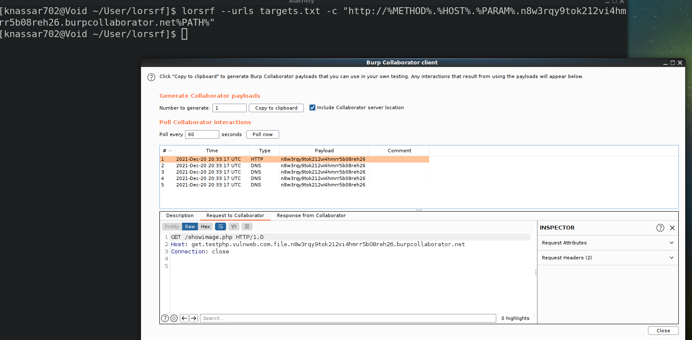

# LORSRF - 2.2


***

lorsrf is just a web pen-testing tool that I wrote to find the parameters that can be used to find SSRF or Out-of-band resource load by adding OAST host like Burp Collaborator to the parameter value, above of all, the request that will be received in Burp Collaborator will be an HTTP request without any real pieces of information about the target, i was thinking about how can i get vulnerable parameter/endpoint , Hence i made a simple feature is that allowed you to add some pieces of information of the target in your OAST host as a variables
	
 
| Variable      | Description |
| ----------- | ----------- |
| %PARAM%      | the guessed parameter      |
| %PATH%   |  the endpoint of your target domain |
| %HOST%   | the scanning host
| %QUERY% | the query of the url |
| %METHOD% | Current METHOD |

you can use these for include more informations in your OAST host

```
target: http://testphp.vulnweb.com/showimage.php
payload: http://%HOST%.%PARAM%.testing.interactsh.com%PATH%
output: http://testphp.vulnweb.com.file.testing.interactsh.com/showimage.php
```

by default lorsrf use GET method if you want post method with form body or json you can add these falgs

```bash
$ lorsrf --json --form
```

if you want post only add `--post-only` flag


### Install
1. install the last version of rust from https://www.rust-lang.org/tools/install
2. run these commmands
```bash
>>> apt install gcc pkg-config libssl-dev
>>> cargo install --git https://github.com/knassar702/lorsrf
```

#### Examples

```
$ lorsrf --urls targets.txt -c "http://myhost.com" --wordlist params.txt
```

* json

```


$ lorsrf --urls targets.txt -c "http://myhost.com" --wordlist params.txt --json
```

* form

```
$ lorsrf --urls targets.txt -c "http://myhost.com" --wordlist params.txt --form
```


parameter scanner without geussing

```bash
$ waybackurls http://testphp.vulnweb.com > urls.txt
$ lorsrf --urls urls.txt -c "http://myhost.com" --wordlist params.txt
```


* Video: [demo](https://twitter.com/knassar702/status/1472566701027901450)

more options

```bash
Lorsrf 2.0
Khaled Nassar <knassar702@gmail.com>
SSRF Parameter BruteForce Tool

USAGE:
    lorsrf [FLAGS] [OPTIONS] --call <host> --urls <targets>

FLAGS:
    -f, --form         Use x-www-form-urlencoded requests via POST method
    -h, --help         Prints help information
    -j, --json         Use JSON requests via POST method
        --post-only    POST method only
    -V, --version      Prints version information

OPTIONS:
    -H, --headers <headers>      Your Headers [default: ]
    -c, --call <host>            Your The OAST Host (burpsuite collaborator or interactsh.com)
    -p, --proxy <proxy>          SendProxy [default: ]
    -u, --urls <targets>         Your Targets list
        --threads <threads>      Your Threads [default: 10]
    -t, --timeout <timeout>      Set the Timeout of the requests [default: 10]
    -w, --wordlist <wordlist>    Your Parameters Wordlist
```


### TODO-LIST
* https://github.com/knassar702/lorsrf/projects/1
